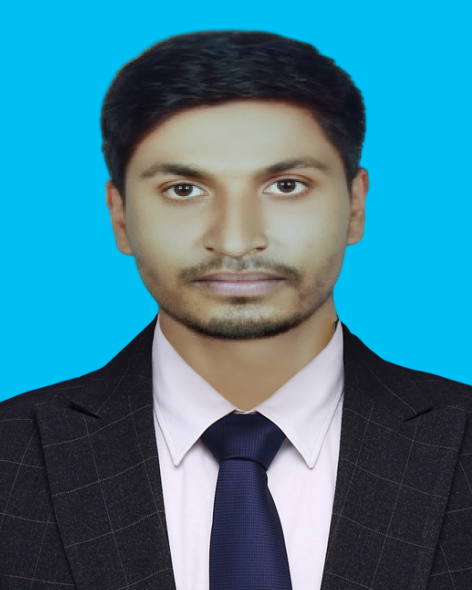

# 👋 Hello, I'm  Md.Bokul islam

- 🔭 web developer
- 🏠 Living in Dhaka, Bangladesh
- 📚 I am currenty study in B.sc in CSE at BUBT.

## 👨‍🏫 About Me

I am currently pursuing a Bachelor of Science in Computer Science and Engineering (BSc in CSE). My academic journey is focused on exploring the intricate world of software development, algorithms, and computer systems. 

## 👨🏽‍💻 My Skills:

### Key Skills & Videos on Web Development:
html5, css3, bootstrap, javascript, mongodb, mysql, github

### Other Skills:
c, c++, java, android, python.

## 👨🏻‍🎓 Education

- B.Sc. in Computer Science & Engineering  
  Bangladesh University of Business And Technology, Dhaka, Bangladesh.
-  Diploma in Computer Science 
  Kushtia Polytechnic Institute .

## 🌐 Languages

- BD Bangla: Native
- 🏴 English: Advanced
- IN Hindi: Intermediate

## 🏆 Sports / Games / Activities / Hobbies

- 🏏 Cricket, ⚽ Football, 🏸 Badminton, 🏐 Volleyball
-  🏃‍♂️ Running, 🚶‍♂️ Walking
- ✈️ Traveling

